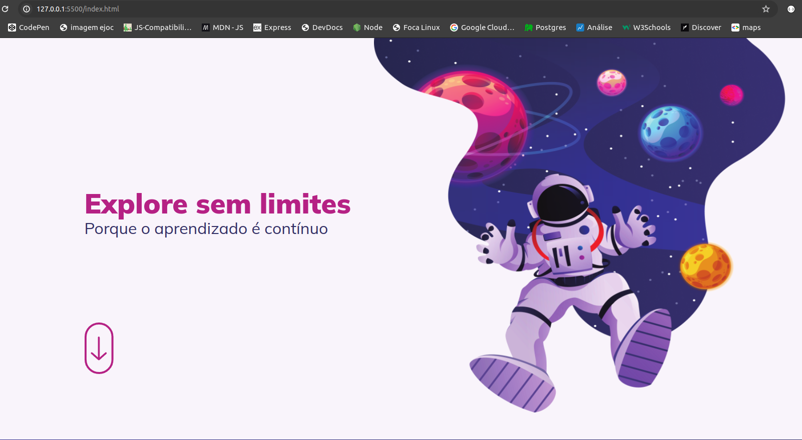
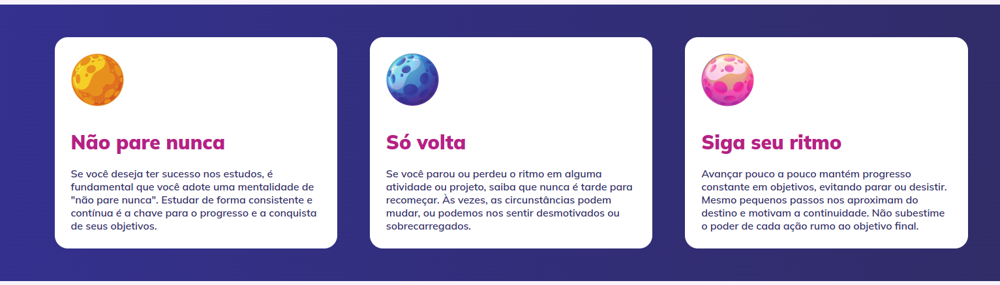
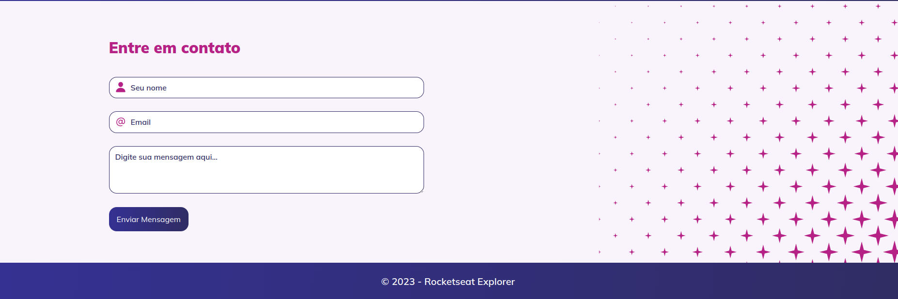

# Biscoito da Sorte

Site estático feito para treinar e consolidar conhecimentos básicos de HTML e CSS. A criação partiu da regra do mobile first, medidas flexíveis, animações, etc.

Laytout:

  

  

  

Tecnologias utilizadas no projeto:

- HTML e CSS
- Git e Github
- Figma

